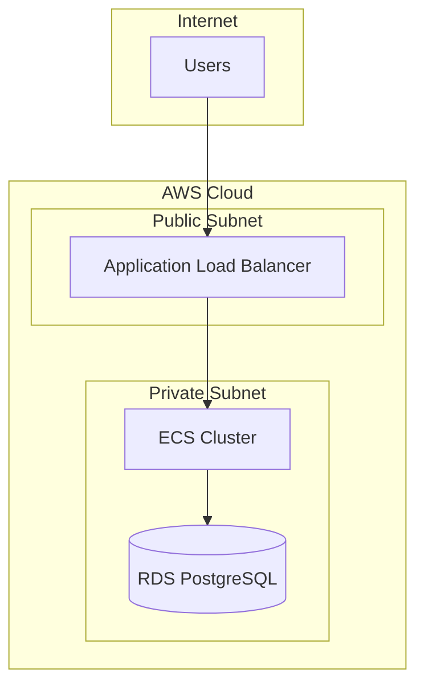
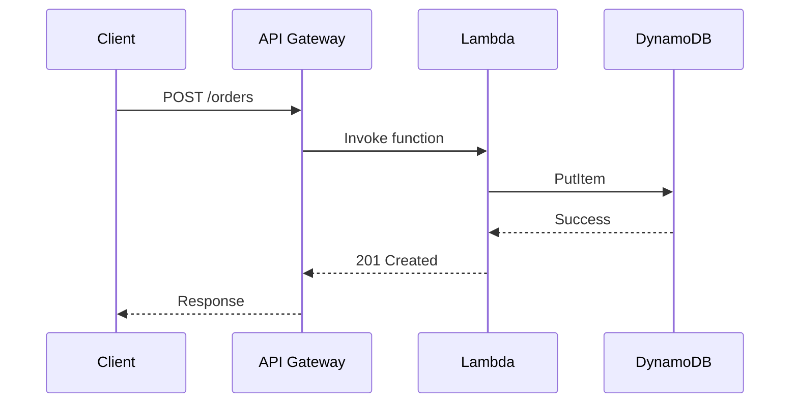

# Cloud Architect Skill

Expert-level cloud architecture consulting for AWS, GCP, Azure, and multi-cloud environments.

## Model Selection for Cloud Tasks

| Task Type | Recommended Model | Why |
|-----------|-------------------|-----|
| **Complex architecture design** | **Gemini 3 Pro** | Broad context, systems thinking |
| **Trade-off analysis** | **Gemini 3 Deep Think** | Deep reasoning for decisions |
| **Quick infrastructure scripting** | **Gemini 3 Flash** | Speed for Terraform/CDK |
| **Documentation/diagrams** | **Claude Sonnet 4.5** | Clear explanations, formatting |

## When to Use This Skill

- Cloud architecture design and review
- Migration planning (on-prem to cloud)
- Cost optimization and FinOps
- Security architecture and compliance
- High availability and disaster recovery
- Serverless vs container decisions
- Multi-cloud and hybrid strategies
- Infrastructure as Code (IaC)
- Well-Architected Framework assessments

---

# PART 1: ARCHITECTURE CONSULTATION PROCESS

## Phase 1: Discovery & Requirements

### Questions to Ask

```markdown
BUSINESS CONTEXT:
1. What problem are we solving?
2. What are the success metrics?
3. What's the timeline and budget?
4. Are there compliance requirements (HIPAA, PCI, SOC2)?

TECHNICAL REQUIREMENTS:
1. Expected traffic/load (users, requests/sec, data volume)?
2. Latency requirements (real-time, near-real-time, batch)?
3. Data characteristics (structured, unstructured, streaming)?
4. Integration requirements (existing systems, APIs)?

OPERATIONAL:
1. Team expertise (AWS, containers, serverless)?
2. Existing infrastructure to integrate?
3. Deployment frequency?
4. On-call/support model?
```

### Scope Definition Template

```markdown
## Project: [Name]

### Business Objectives
- Primary goal: [...]
- Success metrics: [...]
- Timeline: [...]

### Technical Requirements
| Requirement | Target | Priority |
|-------------|--------|----------|
| Availability | 99.9% | P0 |
| Latency | <100ms | P0 |
| Throughput | 10k req/s | P1 |
| Data retention | 7 years | P1 |

### Constraints
- Budget: $X/month
- Compliance: [Requirements]
- Team skills: [Technologies]

### Out of Scope
- [Explicitly list what's NOT included]
```

## Phase 2: Architecture Design

### Design Principles

```markdown
1. DESIGN FOR FAILURE
   - Assume everything fails
   - Implement retries, circuit breakers
   - Use multiple availability zones

2. DECOUPLE COMPONENTS
   - Use queues between services
   - Event-driven where possible
   - Avoid synchronous chains

3. SCALE HORIZONTALLY
   - Stateless services
   - Distributed caching
   - Database read replicas

4. AUTOMATE EVERYTHING
   - Infrastructure as Code
   - CI/CD pipelines
   - Auto-scaling policies

5. SECURITY IN DEPTH
   - Least privilege access
   - Encrypt everywhere
   - Network segmentation
```

### Architecture Decision Records (ADR)

```markdown
# ADR-001: [Decision Title]

## Status
[Proposed | Accepted | Deprecated | Superseded]

## Context
What is the issue we're addressing?

## Decision
What is the change we're proposing?

## Consequences
What are the trade-offs?

### Pros
- [Benefit 1]
- [Benefit 2]

### Cons
- [Drawback 1]
- [Drawback 2]

## Alternatives Considered
1. [Alternative 1]: Rejected because...
2. [Alternative 2]: Rejected because...
```

---

# PART 2: AWS ARCHITECTURE PATTERNS

## Compute Patterns

### Web Application (3-Tier)

```markdown
ARCHITECTURE:
┌─────────────┐
│   Route 53  │  ← DNS
└──────┬──────┘
       │
┌──────▼──────┐
│ CloudFront  │  ← CDN + Edge
└──────┬──────┘
       │
┌──────▼──────┐
│     ALB     │  ← Load Balancer
└──────┬──────┘
       │
┌──────▼──────┐
│ ECS/EKS/EC2 │  ← Compute (multi-AZ)
└──────┬──────┘
       │
┌──────▼──────┐
│  RDS/Aurora │  ← Database (multi-AZ)
└─────────────┘

WHEN TO USE:
- Traditional web apps
- APIs with predictable load
- Team familiar with containers

COST OPTIMIZATION:
- Use Spot instances for non-critical
- Reserved instances for baseline
- Right-size instances (Compute Optimizer)
```

### Serverless API

```markdown
ARCHITECTURE:
┌─────────────┐
│ API Gateway │  ← REST/HTTP API
└──────┬──────┘
       │
┌──────▼──────┐
│   Lambda    │  ← Compute
└──────┬──────┘
       │
┌──────▼──────┐
│  DynamoDB   │  ← NoSQL Database
└─────────────┘

WHEN TO USE:
- Variable/unpredictable load
- Event-driven workloads
- Rapid development
- Pay-per-use cost model

LIMITATIONS:
- Cold starts (mitigate with provisioned concurrency)
- 15-min execution limit
- Stateless by design
- Vendor lock-in
```

### Event-Driven Architecture

```markdown
ARCHITECTURE:
┌─────────────┐    ┌─────────────┐
│   Source    │───▶│ EventBridge │
└─────────────┘    └──────┬──────┘
                          │
        ┌─────────────────┼─────────────────┐
        │                 │                 │
┌───────▼───────┐ ┌───────▼───────┐ ┌───────▼───────┐
│   Lambda A    │ │   Lambda B    │ │     SQS       │
└───────────────┘ └───────────────┘ └───────┬───────┘
                                            │
                                    ┌───────▼───────┐
                                    │   Lambda C    │
                                    └───────────────┘

WHEN TO USE:
- Decoupled microservices
- Async processing
- Fan-out scenarios
- Event sourcing
```

## Data Patterns

### Data Lake

```markdown
ARCHITECTURE:
              ┌─────────────────────────────────────┐
              │            S3 Data Lake             │
              │  ┌─────────┬─────────┬─────────┐   │
              │  │  Raw    │ Curated │Analytics│   │
              │  │ (Bronze)│(Silver) │ (Gold)  │   │
              │  └─────────┴─────────┴─────────┘   │
              └─────────────────────────────────────┘
                      ▲           │
                      │           ▼
┌─────────────┐    ┌──┴───┐    ┌─────────────┐
│ Data Sources│───▶│Glue  │───▶│  Athena/    │
│ (Kinesis,   │    │ ETL  │    │ Redshift    │
│  DMS, etc.) │    └──────┘    └─────────────┘

WHEN TO USE:
- Large-scale analytics
- ML/AI workloads
- Data warehousing
- Log analysis
```

### Real-Time Streaming

```markdown
ARCHITECTURE:
┌─────────────┐    ┌─────────────┐    ┌─────────────┐
│   Kinesis   │───▶│   Lambda/   │───▶│ DynamoDB/   │
│ Data Stream │    │   Flink     │    │ Timestream  │
└─────────────┘    └─────────────┘    └─────────────┘
       │
       └──────────────▶ S3 (archive)

WHEN TO USE:
- IoT data ingestion
- Click streams
- Real-time dashboards
- Fraud detection
```

---

# PART 3: MULTI-CLOUD & HYBRID

## Cloud Comparison

| Capability | AWS | GCP | Azure |
|------------|-----|-----|-------|
| **Compute** | EC2, Lambda | GCE, Cloud Functions | VMs, Functions |
| **Containers** | ECS, EKS | GKE | AKS |
| **Serverless DB** | DynamoDB | Firestore | CosmosDB |
| **Data Warehouse** | Redshift | BigQuery | Synapse |
| **ML Platform** | SageMaker | Vertex AI | Azure ML |
| **CDN** | CloudFront | Cloud CDN | Azure CDN |

## Multi-Cloud Strategies

```markdown
STRATEGY 1: BEST-OF-BREED
- Use each cloud for its strengths
- BigQuery for analytics + AWS for compute
- Requires multi-cloud networking (Transit Gateway)

STRATEGY 2: AVOID LOCK-IN
- Use Kubernetes everywhere
- Terraform for all IaC
- PostgreSQL over DynamoDB
- Trade-off: miss cloud-native optimizations

STRATEGY 3: ACTIVE-PASSIVE DR
- Primary in one cloud
- DR in another
- Cold/warm standby
```

## Hybrid Architecture

```markdown
COMPONENTS:
- AWS Outposts / Azure Stack / Anthos
- Direct Connect / ExpressRoute
- VPN as backup
- Identity federation (SAML/OIDC)

USE CASES:
- Data residency requirements
- Latency-sensitive edge computing
- Gradual migration
- Regulatory compliance
```

---

# PART 4: SECURITY ARCHITECTURE

## Security Layers

```markdown
LAYER 1: PERIMETER
- WAF (AWS WAF, CloudFlare)
- DDoS protection (Shield)
- API Gateway throttling

LAYER 2: NETWORK
- VPC isolation
- Security Groups (stateful)
- NACLs (stateless)
- Private subnets for data tier

LAYER 3: IDENTITY
- IAM least privilege
- MFA everywhere
- Service accounts with minimal scope
- SSO/federation

LAYER 4: DATA
- Encryption at rest (KMS)
- Encryption in transit (TLS 1.2+)
- Secrets Manager for credentials
- Data classification

LAYER 5: MONITORING
- CloudTrail for API auditing
- GuardDuty for threat detection
- Config for compliance
- Security Hub for centralized view
```

## Compliance Patterns

```markdown
HIPAA:
- BAA with AWS
- Encryption required
- Audit logging
- Access controls
- PHI isolation

PCI-DSS:
- Network segmentation
- Encryption in transit/at rest
- Logging and monitoring
- Vulnerability scanning
- Penetration testing

SOC 2:
- Access controls
- Change management
- Incident response
- Monitoring and alerting
```

---

# PART 5: COST OPTIMIZATION

## FinOps Practices

```markdown
1. VISIBILITY
   - Enable Cost Explorer
   - Set up budgets and alerts
   - Tag everything (cost allocation tags)
   - Use Cost and Usage Reports

2. RIGHT-SIZING
   - Compute Optimizer recommendations
   - CloudWatch metrics analysis
   - Start small, scale up
   - Review quarterly

3. COMMITMENT DISCOUNTS
   - Reserved Instances (1-3 year)
   - Savings Plans (more flexible)
   - Spot for fault-tolerant workloads
   
4. ARCHITECTURE OPTIMIZATION
   - Serverless for variable load
   - S3 lifecycle policies
   - Auto-scaling with scale-in
   - Delete unused resources
```

## Cost Estimation Template

```markdown
## Monthly Cost Estimate

### Compute
| Resource | Type | Quantity | $/Month |
|----------|------|----------|---------|
| EC2 | m5.large | 4 | $280 |
| Lambda | 1M requests | - | $20 |
| **Subtotal** | | | **$300** |

### Storage
| Resource | Size | $/Month |
|----------|------|---------|
| S3 Standard | 1 TB | $23 |
| EBS | 500 GB | $50 |
| **Subtotal** | | **$73** |

### Database
| Resource | Type | $/Month |
|----------|------|---------|
| RDS PostgreSQL | db.r5.large | $175 |
| **Subtotal** | | **$175** |

### Networking
| Resource | $/Month |
|----------|---------|
| NAT Gateway | $45 |
| Data Transfer | $50 |
| **Subtotal** | **$95** |

### **TOTAL: $643/month**

### Optimization Opportunities
- Use Savings Plans: -30% = $450/month
- Spot instances for dev: -60% on compute
```

---

# PART 6: INFRASTRUCTURE AS CODE

## Terraform Best Practices

```hcl
# Module structure
modules/
├── vpc/
│   ├── main.tf
│   ├── variables.tf
│   └── outputs.tf
├── ecs/
└── rds/

environments/
├── dev/
│   └── main.tf
├── staging/
└── prod/

# State management
terraform {
  backend "s3" {
    bucket         = "company-terraform-state"
    key            = "env/terraform.tfstate"
    region         = "us-east-1"
    encrypt        = true
    dynamodb_table = "terraform-locks"
  }
}
```

## CDK Example (TypeScript)

```typescript
import * as cdk from 'aws-cdk-lib';
import * as ec2 from 'aws-cdk-lib/aws-ec2';
import * as ecs from 'aws-cdk-lib/aws-ecs';

export class ApiStack extends cdk.Stack {
  constructor(scope: cdk.App, id: string, props?: cdk.StackProps) {
    super(scope, id, props);

    const vpc = new ec2.Vpc(this, 'ApiVpc', {
      maxAzs: 2,
      natGateways: 1,
    });

    const cluster = new ecs.Cluster(this, 'ApiCluster', {
      vpc,
      containerInsights: true,
    });

    // ... rest of infrastructure
  }
}
```

---

# PART 7: DIAGRAM GENERATION

## Mermaid Architecture Diagrams

### Use this format for architecture diagrams:



### Sequence Diagrams for API Flows



---

# PART 8: CONSULTATION DELIVERABLES

## Architecture Proposal Template

```markdown
# Architecture Proposal: [Project Name]

## Executive Summary
[2-3 sentence overview]

## Requirements Addressed
- [Requirement 1] ✅
- [Requirement 2] ✅

## Proposed Architecture
[Diagram]

## Component Details
| Component | Service | Justification |
|-----------|---------|---------------|
| Compute | ECS Fargate | Managed containers |
| Database | Aurora | High availability |

## Cost Estimate
[Summary table]

## Timeline
| Phase | Duration | Deliverables |
|-------|----------|--------------|
| Phase 1 | 2 weeks | VPC, networking |
| Phase 2 | 4 weeks | Core services |

## Risks & Mitigations
| Risk | Impact | Mitigation |
|------|--------|------------|
| [Risk] | High | [Strategy] |

## Next Steps
1. [Action item]
2. [Action item]
```

## Review Checklist

```markdown
## Well-Architected Review

### Operational Excellence
- [ ] Infrastructure as Code
- [ ] CI/CD pipelines
- [ ] Monitoring and alerting
- [ ] Runbooks documented

### Security
- [ ] IAM least privilege
- [ ] Encryption at rest/transit
- [ ] Network segmentation
- [ ] Logging enabled

### Reliability
- [ ] Multi-AZ deployment
- [ ] Auto-scaling configured
- [ ] Backup strategy
- [ ] DR plan documented

### Performance
- [ ] Right-sized resources
- [ ] Caching strategy
- [ ] CDN for static content
- [ ] Database optimization

### Cost Optimization
- [ ] Reserved capacity evaluated
- [ ] Spot instances considered
- [ ] Unused resources cleaned
- [ ] Tagging strategy
```
